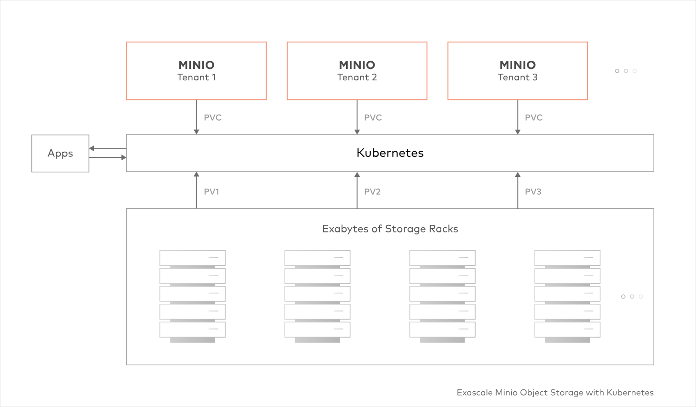

# go-files-store
Service for get/set files

### Getting start

```
docker-compose up
```

### ENV

| Name                | Value                            |
|---------------------|----------------------------------|
| MINIO_ENDPOINT      | localhost:9001                   |
| MINIO_ACCESS_KEY    | ACCESS_KEY                       |
| MINIO_SECRET_KEY    | SECRET_KEY                       |
| MINIO_SECURE        | false                            |

### Feature

- Service fro work with files (set/get/delete)
- Minio cluster
  - lambda compute

### Architecture


